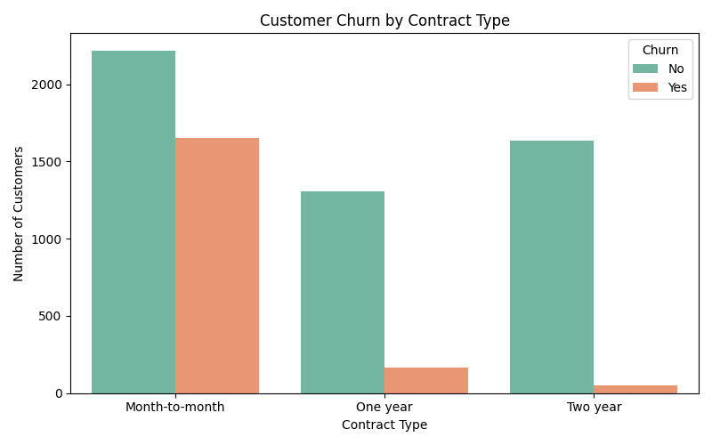
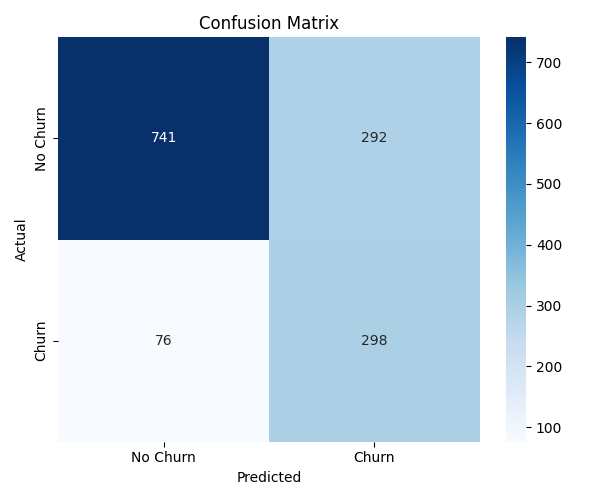
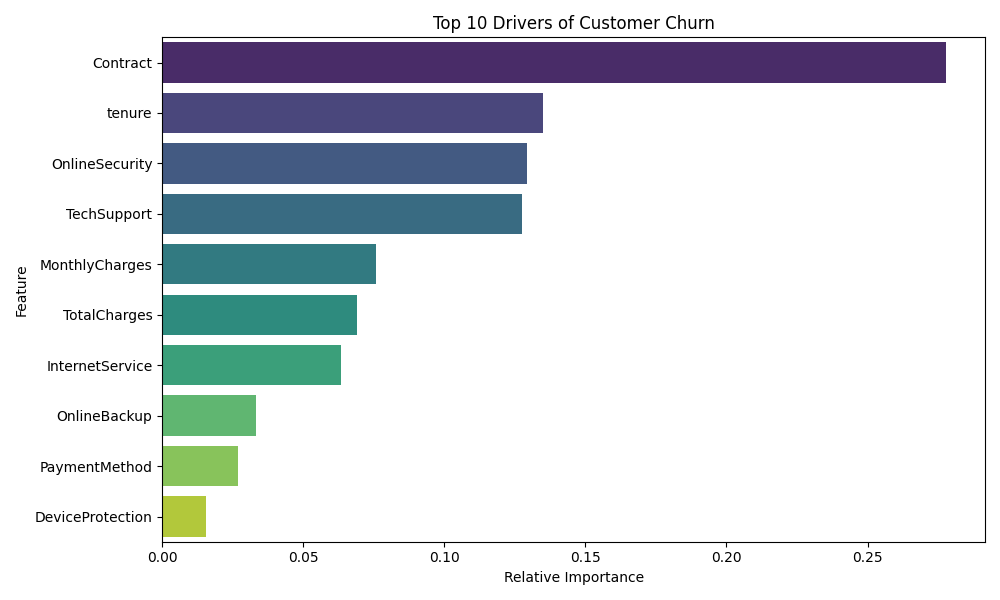

# Telecom Customer Churn ML Pipeline

This project demonstrates an end-to-end Machine Learning pipeline predicting customer churn using the Telco Customer Churn dataset (7,043 customer records). It highlights data preprocessing, exploratory data analysis (EDA), and predictive modeling using a Random Forest algorithm.

## Overview

Customer churn is a critical metric for subscription-based services. By accurately predicting which customers are at risk of leaving, companies can proactively target them with retention campaigns. 

This project specifically focuses on:
- Minimizing false negatives (maximizing **Recall**) to ensure as many at-risk customers as possible are identified for the retention campaign.
- Handling class imbalance using balanced class weights.
- Identifying key drivers of churn via feature importance analysis.

## Key Findings & EDA

During the exploratory data analysis, we discovered a major indicator of churn:
**Month-to-month contract holders are 4x more likely to churn** compared to customers on one-year or two-year contracts.



## Model Performance

A `RandomForestClassifier` was trained and optimized for this dataset.

**Evaluation Metrics:**
- **F1-Score**: ~0.70
- **Accuracy**: ~71%
- **Recall**: ~69% (Optimized to minimize false negatives and capture at-risk customers)



## Feature Importance Analysis

Using the trained Random Forest model, we extracted the feature importances to determine the top drivers of churn. The analysis identified **`tenure`** and **`MonthlyCharges`** as the top numerical drivers, alongside the customer's contract type.



## Project Structure
- `churn_prediction.py`: The main script that downloads the dataset, processes it, creates the visualizations, and trains the model.
- `requirements.txt`: Python package dependencies.
- `Telco-Customer-Churn.csv`: The dataset used for training (downloaded automatically if not present).

## Setup and Usage

1. **Install Requirements**:
   ```bash
   pip install -r requirements.txt
   ```

2. **Run the Script**:
   ```bash
   python churn_prediction.py
   ```
   *Running the script will output the metrics and generate the PNG visualizations locally.*
